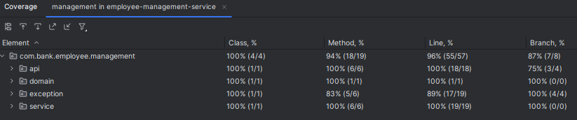

# API Employee Management Service

This service will perform employee create, view, update and delete based on the user roles.

* Admin role can perform employee create and delete. Basic auth credential - `admin:adminpwd`.
* User role can perform view and update employee. Basic auth credential - `user:userpwd`.

## Run Instruction

### Build and Test
    - Use 'mvc clean install' to build the application and run unit and spring boot integration test.

### Run application
    - Use 'java -jar .\employee-management-service-0.0.1.jar' from the jar file location.

### Test API using Swagger UI
    - Use swagger to test the API's - http://localhost:8080/swagger-ui/index.html.

### NOTE: 
Ensure to run the employee database service for testing this API. 
Refer the Database service for instruction: [README.md](https://github.com/karthikeyansub/employee-database-service/blob/master/README.md)

## Requirement assumptions:
* Only ADMIN role user can perform create and delete, and USER role can perform only view and update. Assuming manager role user cannot perform any operation.

## Test results:
